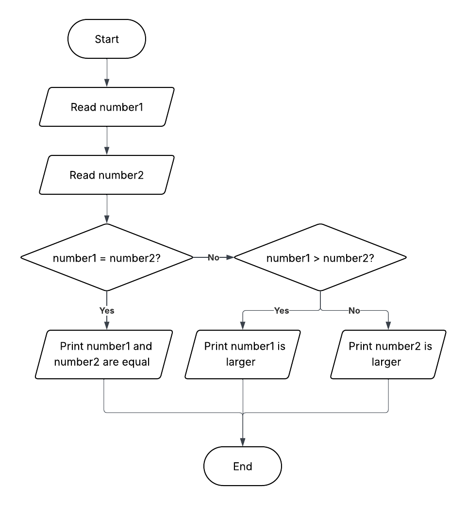

# What is Programming?

Programming is the process of **instructing a computer to perform tasks** by writing a set of commands in a language it understands.

In simple terms:

- A **program** is a list of instructions that a computer follows.
- A **programmer** is someone who designs, writes, and tests those instructions.

Programming lets us:

- Automate repetitive tasks
- Solve complex problems
- Build applications (games, web apps, scientific simulations, etc.)

**In CCPROG1, C** is the programming language you’ll use to start learning the fundamentals of programming.

# Program Development Cycle

The **Program Development Cycle** describes the process of creating a program from an idea to a working solution.

**Steps:**

1. **Define the Problem** – Understand what needs to be solved.
2. **Plan the Solution** – Use logic formulation (flowcharts, pseudocode).
3. **Code the Program** – Translate your plan into C code.
4. **Test and Debug** – Verify correctness and fix issues.
5. **Document and Maintain** – Make your code understandable and update it if needed.

This cycle is repeated many times during development, especially the coding–testing–debugging steps.

# Logic Formulation

Before writing code, programmers often create a **plan** for solving the problem. This is called **logic formulation**.

Two common methods:

- **Pseudocode**: A plain-English outline of the steps your program will take.
- **Flowcharts**: Diagrams showing the sequence of steps and decisions.

**Example Problem:**  
"Find the largest of two numbers."

**Pseudocode:**

```pseudocode
Read number1, number2
If number1 = number2
    Print number1 and number2 are the same
Else If number1 > number2
    Print number1 is larger
Else
    Print number2 is larger
```

**Flowchart:**



## Task

**Calculate the area of a circle**

Write the steps for the program (in Pseudocode and a Flowchart):

1. Asks the user to input the radius of the circle
2. Computes the area using the formula:
   ```pseudocode
   area = PI * radius * radius
   ```
3. Display the result
